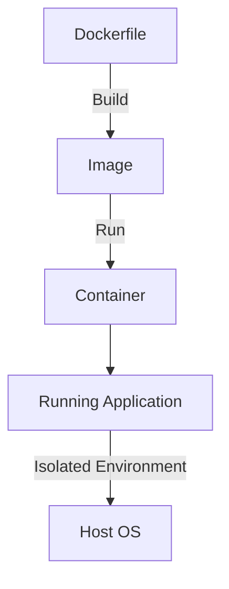

-----

## Docker Tutorial

Bu MDX hujjati Docker'ga kirishni va uning asosiy tushunchalarini tushuntirish uchun yaratilgan. Quyida sizga Docker haqida asosiy ma'lumotlar va uning ishlash prinsipi tushuntiriladi.

### Docker nima?

**Docker** - bu ilovalarni ularning barcha bog'liqliklari (dependencies) bilan birga **konteynerlarga** joylashtirishga yordam beradigan ochiq manbali platforma. Konteynerlar ilovalarning turli xil muhitlarda (development, testing, production) bir xil ishlashini ta'minlaydi.

### Asosiy tushunchalar

  - **Image (Tasvir)**: Konteyner yaratish uchun ishlatiladigan andaza (template). U ilova kodini, runtime, tizim vositalarini va bog'liqliklarini o'z ichiga oladi.
  - **Container (Konteyner)**: Image asosida yaratilgan, ishga tushiriladigan (runnable) ilova nusxasi. Konteyner izolyatsiya qilingan va mustaqil muhitda ishlaydi.
  - **Dockerfile**: Docker image yaratish uchun ishlatiladigan ko'rsatmalar (instructions) yozilgan matn fayli.

### Docker ishlash prinsipi

Quyidagi Mermaid diagrammasi Dockerning asosiy jarayonini ko'rsatadi:



### Amaliy misol

Oddiy Python veb-ilovasi uchun `Dockerfile` misoli:


```dockerfile
# Base image sifatida Python 3.9 ni ishlatamiz
FROM python:3.9-slim

# Ishchi katalog (working directory) o'rnatamiz
WORKDIR /app

# Talab qilinadigan bog'liqliklarni (dependencies) nusxalaymiz
COPY requirements.txt .

# Bog'liqliklarni o'rnatamiz
RUN pip install --no-cache-dir -r requirements.txt

# Ilova kodini nusxalaymiz
COPY . .

# Konteyner ishga tushganda bajariladigan buyruq
CMD ["python", "app.py"]
```

-----